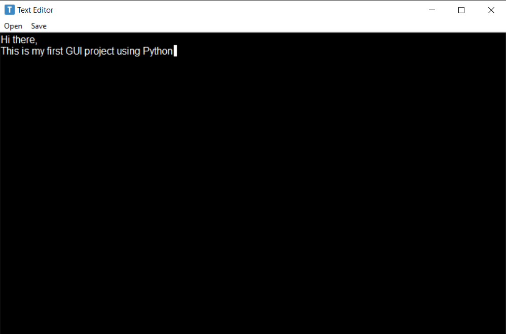

  # Text Editor 📝  
  This is a very simple GUI desktop text editor     
 

## Screenshot  

## Tech Stack  

<!-- PYTH❤N -->
 

## Features  

- Dark Mode  
- Saving text files  
- Editing existing text files 
- Keyboard shortcuts 
- Responsive UI 

## Lessons Learned  

Practiced using tkinter. Dealt with multiple simple classes and options.

## Run Locally  

Clone the project  

~~~bash  
  git clone https://github.com/Mohabz-911/TextEditor
~~~

Go to the project directory  

~~~bash  
  cd TextEditor
~~~

Install python

Start the program  

~~~bash  
py .\TextEditor.py
~~~

## Feedback  

If you have any feedback, please reach out to us at mohabmohamedmohamedzaghloul@gmail.com

## License  

[MIT](https://choosealicense.com/licenses/mit/)
